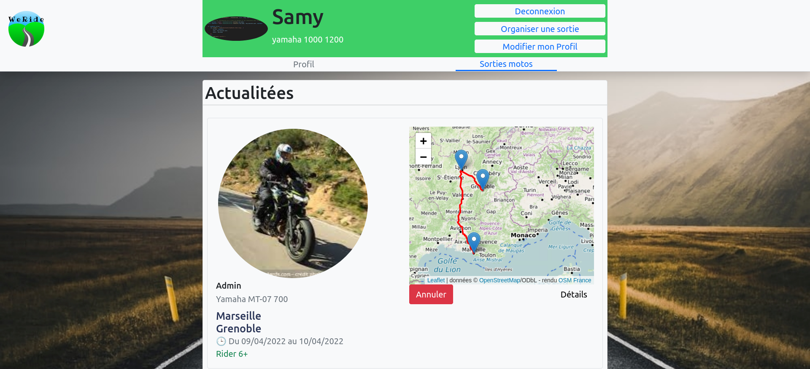

# WeRide - Social Network for Bikers

<div align='center'>


</div>

This project, named "WeRide," is a social network designed for bikers. It allows users to register, log in, propose outings with routes and schedules on an interactive map, and participate in organized rides. Additionally, an admin account is available for site management.

This project was created in collaboration with my colleague [Ylies Azzouz](lien-vers-le-GitHub-de-votre-collegue), who made a valuable contribution to the development of WeRide.



## Project Realization

WeRide was our diploma project, representing a significant milestone in our education. To manage our time and resources efficiently, we used a Gantt chart to plan tasks and deadlines throughout the project.

We followed a comprehensive design process for this project:

- **Requirements Document**: We defined the expected needs and features.
- **Functional Breakdown**: We divided the project into key modules and features.
- **Conceptual Data Model (CDM)**: We designed the database structure to store essential information.

- **Specifications**: We detailed the technical specifications of the project.
- **Figma Mockups**: We designed the user interfaces using Figma.

## Technologies Used

We used a variety of technologies to develop WeRide, including:

- HTML and CSS for structure and presentation.
- Bootstrap for user-friendly layout.
- Twig for the template engine.
- Node.js and Express for the backend.
- MongoDB for database management.
- JavaScript for interactive features.
- [Leaflet](https://leafletjs.com/) for integrating the interactive map.

## How to Launch the Project

To run this project on your computer, follow these steps:

1. Clone the project repository to your local machine.

2. Run `npm install` to install the necessary dependencies.

3. Start the application with `npm start`.

4. Access the application via [http://localhost:8084](http://localhost:8084).

## MongoDB Configuration

Before launching the project, ensure you have MongoDB installed. If not, you can download it from the [official MongoDB website](https://www.mongodb.com/fr-fr). You will also need to create a MongoDB database.

After configuring MongoDB, modify the `config.js` file as follows:

```javascript
export class Config {
  static dbUserName = "yourUserName";
  static dbPassword = "yourDbPassword";
  static bdClusterName = "yourDbCluster";
  static bdNameDatabase = "databaseName (weride)";
}
```

## Collaboration on the Project

The "WeRide" project is the result of collaborative work, combining our skills and dedication to provide an exceptional experience for bikers. You can check out [my colleague's GitHub](lien-vers-le-GitHub-de-votre-collegue) to learn more about his contribution to the project.

